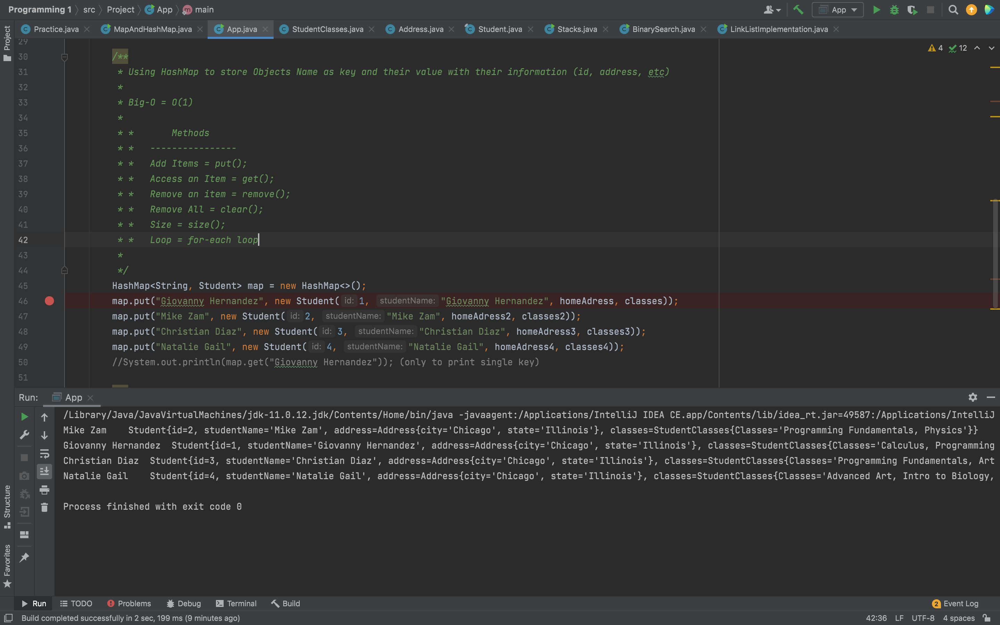

<p align="center">
    
</p>

<h1 align="center">Student Program</h1>

<div align="center">
A program that stores rolling Students Data into the Local Storage </br></br>
</div>

### 📊 Project idea: Object-Oriented Programming Introductory

## 🌟 Features/Concepts Learned

- 💻 Classes
- 🖥 Immutable/mutable Classes
- 📊 Data Fields
- 💻 Methods
- 🗄 Setters/Getters
- 💻 Protecting Immutable class
- ➕ Data Structures (HashMap)
- 🔀 Storing Objects into a Data Structures (key/value)

### ⚒️ Set Up

```
# Open IntelliJ


# Open the files and add them to your local src file

# Add-on and Run the code


```

## 📌 Authors

🧑🏽‍💻 **Giovanny Hernandez** 


